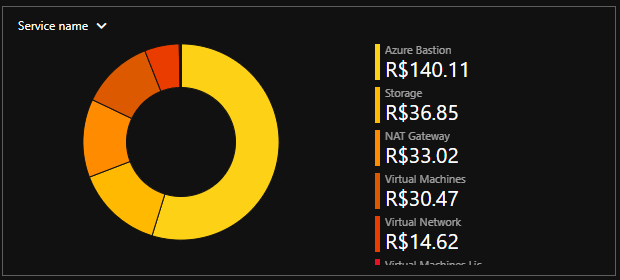

# Arquitetura — Cloud Security Lab

<strong>📜 Histórico de Evolução</strong>

| Data | Alteração |
|---|---|
| 2026-03 | Removido IP público do `JUMP-SERVER-01`; adicionada `AzureBastionSubnet` (`10.10.40.0/26`). |
| 2026-01 | Definição inicial da arquitetura: VNet única segmentada em três subnets por função. |

## 🌐 Visão Geral

Aqui defino a estrutura do laboratório no **Microsoft Azure** e as decisões que orientam sua evolução. A arquitetura parte de uma Virtual Network dedicada, segmentada por função, e vai sendo ajustada conforme novos controles e experimentos são incorporados.

## 🏗️ Estrutura de Rede

| Componente | Bloco CIDR | Função |
|---|---|---|
| `VNET-CLOUD-SECURITY` | `10.10.0.0/16` | Rede principal do laboratório |
| `SNET-MANAGEMENT` | `10.10.10.0/24` | Administração |
| `SNET-SECURITY` | `10.10.20.0/24` | Servidores de segurança |
| `SNET-WORKLOAD` | `10.10.30.0/24` | Workloads futuros |
| `AzureBastionSubnet` | `10.10.40.0/26` | Acesso administrativo via Azure Bastion |

## 🔒 Modelo de Acesso

A administração dos servidores internos não é feita diretamente pela Internet.

- O **Azure Bastion** atua como ponto de entrada administrativo, acessado via navegador (`HTTPS/443`).
- O `SECURITY-SERVER-01` permanece em rede privada e sem IP público.

## 🧩 Segmentação por Subnet

Dividi as subnets por função para aplicar controles de acordo com cada ambiente:

- **Management:** administração e suporte da infraestrutura.
- **Security:** servidores e componentes de segurança.
- **Workload:** camada reservada para aplicações e serviços futuros.

## 🛡️ Decisões de Arquitetura & Segurança

As principais premissas utilizadas até aqui são:

- Segmentação da rede por função.
- Ausência de exposição direta dos servidores internos à Internet.
- Administração centralizada por meio do Azure Bastion.
- Ausência de IPs públicos em servidores internos.
- Controle de tráfego por Network Security Groups (NSGs).
- Estrutura preparada para expansão dos controles de identidade e segurança.

## 📷 Evidência Real

## 📝 Observações

> ### 🔎 Azure Bastion — Consumo de Recursos
>
> **Contexto:** Como este é um ambiente de laboratório, optei por implantar o Azure Bastion para testar seu funcionamento e acompanhar seu impacto real no ambiente.
>
> **Constatação:** Durante o acompanhamento, identifiquei que o Bastion se tornou o maior consumidor de recursos/custo do laboratório.
>
> 
>
> **Decisão:** Mesmo reconhecendo sua importância para um modelo de acesso administrativo mais seguro, decidi remover a função temporariamente para analisar o comportamento do ambiente sem ela.
>
> **Objetivo:** Comparar diferentes abordagens, entender os impactos de cada escolha e utilizar os resultados para evoluir a arquitetura do laboratório.

---

[↑ Laboratório](../README.md) · [Rede →](../02-rede/rede.md)
