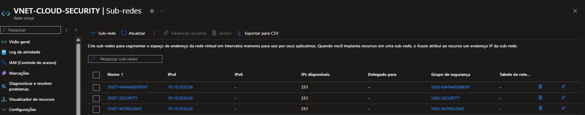

# Arquitetura — Cloud Security Lab

## Visão Geral

O laboratório foi estruturado no Microsoft Azure com o objetivo de separar os diferentes níveis de infraestrutura e reduzir a exposição dos recursos.

A arquitetura utiliza uma Virtual Network dedicada, dividida em subnets com funções específicas.

## Estrutura

A infraestrutura está organizada da seguinte forma:

| Componente | Endereço | Função |
|---|---|---|
| `VNET-CLOUD-SECURITY` | `10.10.0.0/16` | Rede principal do laboratório |
| `SNET-MANAGEMENT` | `10.10.10.0/24` | Administração |
| `SNET-SECURITY` | `10.10.20.0/24` | Servidores de segurança |
| `SNET-WORKLOAD` | `10.10.30.0/24` | Workloads futuros |
| `AzureBastionSubnet` | `10.10.40.0/26` | Acesso via Azure Bastion (sem exposição pública) |

## Modelo de Acesso

A administração dos servidores internos não é realizada diretamente pela Internet. O `Azure Bastion` funciona como ponto de entrada administrativo via navegador (HTTPS/443), e o `SECURITY-SERVER-01` permanece na rede privada, sem IP público.

# Segmentação

A separação das subnets permite aplicar controles diferentes de acordo com a função de cada ambiente.

- ### Management: Responsável pelos recursos utilizados para administração da infraestrutura.

- ### Security : Destinada aos servidores e componentes relacionados à segurança.

- ### Workload: Reservada para aplicações e outros workloads que serão adicionados durante a evolução do laboratório.

## Decisões de Segurança

A arquitetura foi construída considerando:

- Segmentação de rede por função..
- Redução da exposição direta à Internet.
- Administração centralizada através de Jump Server.
- Servidores internos sem IP público.
- Controle de comunicação através de Network Security Groups.
- Evolução futura para controles baseados em identidade.

## Evidência

A arquitetura atual pode ser validada através da evidência abaixo.

## Status

Arquitetura inicial implementada e validada.

Próximas evoluções da arquitetura serão incorporadas conforme novos controles de segurança forem adicionados ao laboratório.

[Retornar ao Laboratório →](../README.md)
