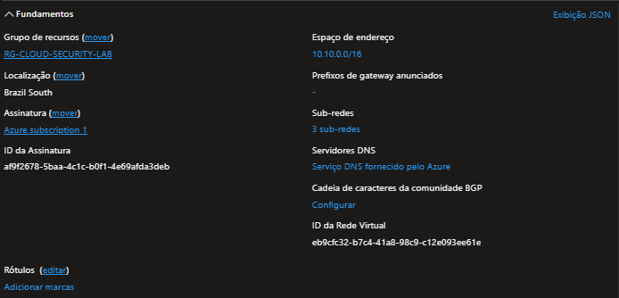

# Arquitetura de Rede

## Virtual Network

A infraestrutura utiliza uma Virtual Network dedicada ao laboratório, com o espaço de endereçamento `10.10.0.0/16`, segmentada em sub-redes específicas para gerenciamento, segurança e workloads.

## Sub-redes

- `SNET-MANAGEMENT` — `10.10.10.0/24`
- `SNET-SECURITY` — `10.10.20.0/24`
- `SNET-WORKLOAD` — `10.10.30.0/24`

## Componentes de Segurança

- Network Security Groups (NSGs) associados às sub-redes.
- `NSG-MANAGEMENT`
- `NSG-SECURITY`
- `NSG-WORKLOAD`

