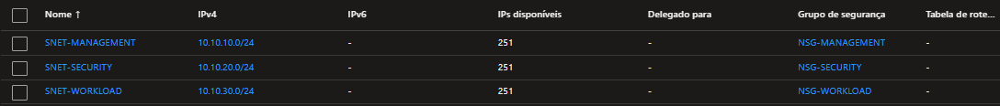

# Rede — Cloud Security Lab

## Histórico de Evolução

| Data | Alteração |
|---|---|
| 2026-03 | Adicionada AzureBastionSubnet (10.10.40.0/26) para suportar acesso via Azure Bastion. |
| 2026-01 | Criação da VNet dedicada e segmentação inicial em SNET-MANAGEMENT, SNET-SECURITY e SNET-WORKLOAD. |

## Estado Atual

Para este laboratório, optei por uma Virtual Network dedicada:

- VNet: `VNET-CLOUD-SECURITY`
- Endereço: `10.10.0.0/16`
- Região: `Brazil South`

Dividi essa rede em subnets de acordo com a função de cada ambiente.

## VNet

## Subnets

Hoje a VNet está segmentada em quatro subnets:

| Subnet | Endereço | Função |
|---|---|---|
| `SNET-MANAGEMENT` | `10.10.10.0/24` | Administração |
| `SNET-SECURITY` | `10.10.20.0/24` | Servidores de segurança |
| `SNET-WORKLOAD` | `10.10.30.0/24` | Workloads futuros |
| `AzureBastionSubnet` | `10.10.40.0/26` | Acesso administrativo via Bastion |

## Network Security Groups

Cada subnet possui um Network Security Group dedicado:

- `NSG-MANAGEMENT`
- `NSG-SECURITY`
- `NSG-WORKLOAD`

Uso os NSGs para controlar o tráfego entre os diferentes ambientes e limitar a exposição dos recursos ao mínimo necessário.

[Retornar ao Laboratório →](../README.md)
