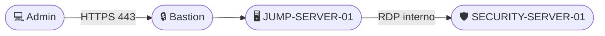

# Controle de Acesso — Cloud Security Lab

<details>
<summary><strong>📜 Histórico de Evolução</strong></summary>

| Data | Alteração |
|---|---|
| 2026-03 | Implementado Azure Bastion e removido o IP público do Jump Server. |
| 2026-02 | Avaliado Microsoft Entra PIM; mantido para evolução futura por limitação de licenciamento. |
| 2026-02 | Configurado MFA para contas administrativas. |
| 2026-02 | Removida atribuição de Owner na assinatura; escopo reduzido para Contributor no Resource Group. |
| 2026-01 | Implementado Azure RBAC com função Leitor no escopo do Resource Group. |
| 2026-01 | Criadas identidades segregadas por função no Microsoft Entra ID. |
| 2026-01 | Implementado controle inicial de acesso com NSGs e Jump Server. |

</details>

## 🎯 Objetivo

Aqui evoluo o controle de acesso ao ambiente, começando pela rede e avançando para identidade, autenticação, autorização e menor privilégio.

## 🗺️ Modelo de Acesso Atual

<div align="center">



</div>

O acesso administrativo direto aos servidores pela Internet foi eliminado. O Azure Bastion é o ponto de entrada administrativo, enquanto os servidores permanecem em rede privada.

## 🏗️ Evolução do Controle de Acesso

### 01 — Controle inicial via rede

Comecei utilizando NSGs e segmentação de subnets para restringir a comunicação administrativa.


### 02 — Identidades segregadas

Passei a utilizar identidades diferentes para administração, leitura e acesso emergencial no Microsoft Entra ID.

### 03 — Azure RBAC

Apliquei o RBAC com escopo limitado ao grupo de recursos `RG-CLOUD-SECURITY-LAB`.

| Identidade | Função | Escopo | Uso |
|---|---|---|---|
| `luiz.azure.reader` | Reader | `RG-CLOUD-SECURITY-LAB` | Leitura |
| `luiz.azure.admin` | Contributor | `RG-CLOUD-SECURITY-LAB` | Administração |
| `lab.breakglass01` | Global Administrator | Microsoft Entra ID | Emergência |
| `lab.breakglass02` | Global Administrator | Microsoft Entra ID | Emergência |


### 04 — Menor privilégio

Depois de validar o ambiente, removi o `Owner` da assinatura e deixei a conta administrativa como `Contributor` apenas no Resource Group.

```text
Antes:  luiz.azure.admin → Owner → Subscription
Depois: luiz.azure.admin → Contributor → RG-CLOUD-SECURITY-LAB
```


### 05 — MFA

Adicionei MFA às contas administrativas:

- `luiz.admin` — Software OATH/TOTP.
- `luiz.azure.admin` — Microsoft Authenticator.


O tenant atual não possui licenciamento para Conditional Access, então controles baseados em risco, dispositivo ou localização ficam para uma evolução futura.

### 06 — PIM

Avaliei o Microsoft Entra Privileged Identity Management para acesso Just-In-Time. A implementação completa depende de licenciamento que não está disponível no tenant atual, então mantive essa evolução documentada para quando o ambiente permitir.


### 07 — Azure Bastion

Por fim, removi o IP público do `JUMP-SERVER-01` e passei o acesso administrativo para o Azure Bastion.

- `AzureBastionSubnet`: `10.10.40.0/26`
- Região: `Brazil South`
- Modo: Basic
- Acesso: portal web via HTTPS (`443`)
- Integração: `AADLoginForWindows` + `Virtual Machine User Login`

## 📈 Trilha de Evolução

```text
NSGs → Entra ID → RBAC → Menor Privilégio → MFA → PIM → Azure Bastion
```

## 🧪 Experimentos e Aprendizados

Novos experimentos, erros, decisões ou descobertas relevantes são registrados aqui conforme surgirem.

### Exemplo

**O que mudou:**  
Descreva a alteração realizada.

**Por que:**  
Explique o problema ou necessidade que motivou a mudança.

**Resultado:**  
Registre como a alteração foi validada e o que foi aprendido.

---

[← Retornar ao Início do Laboratório](../README.md)
