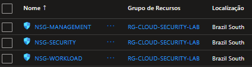
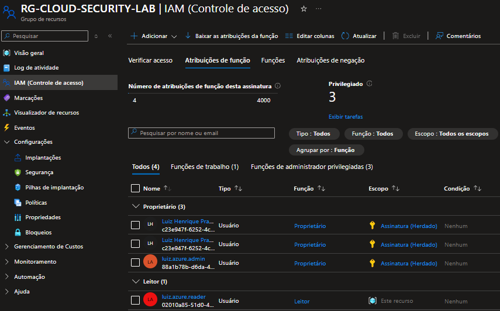
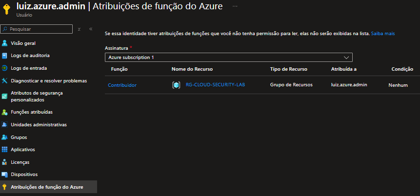
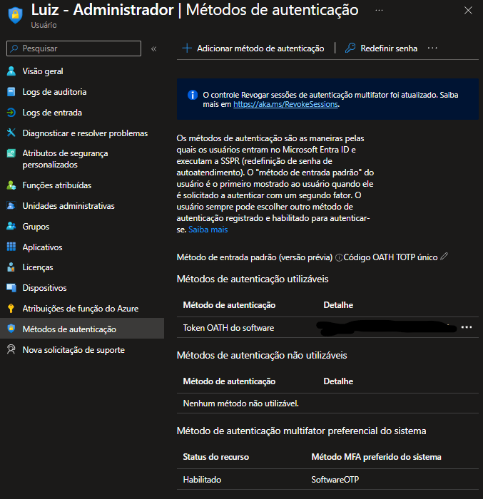
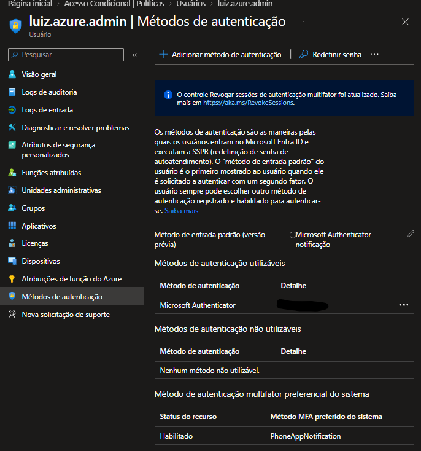

# Controle de Acesso — Cloud Security Lab

## Objetivo

Evoluir progressivamente os controles de acesso do ambiente, começando pelos controles de rede e avançando para controles de identidade, autenticação, autorização e menor privilégio.

---

## Evolução do Controle de Acesso

### Etapa 01 — Controle de acesso pela rede

Na primeira etapa, o controle de acesso administrativo foi implementado principalmente através dos Network Security Groups (NSGs).

O acesso ao ambiente foi segmentado por subnet, permitindo:

- RDP externo somente para o ambiente de gerenciamento;
- RDP interno entre `SNET-MANAGEMENT` e `SNET-SECURITY`;
- ausência de acesso administrativo direto da Internet ao servidor de segurança.

Essa etapa estabeleceu o controle de acesso no nível de rede.

---

### Etapa 02 — Controle de acesso baseado em identidade

Com a estrutura de rede estabelecida, o próximo nível de controle passou a ser a identidade.

Foram criadas contas com finalidades diferentes no Microsoft Entra ID:

- `luiz.admin` — administração de identidade;
- `luiz.azure.admin` — administração do Azure;
- `luiz.azure.reader` — acesso de leitura;
- `lab.breakglass01` — conta de emergência;
- `lab.breakglass02` — conta de emergência.

A separação das identidades permite diferenciar funções administrativas, leitura e acesso emergencial.

---

### Etapa 03 — Evolução para Azure RBAC

Após estabelecer os controles de acesso no nível de rede e estruturar as identidades no Microsoft Entra ID, o controle de acesso passou a ser tratado também no nível de autorização dos recursos Azure.

Como primeiro passo, a identidade `luiz.azure.reader` recebeu a função `Leitor` no escopo do `RG-CLOUD-SECURITY-LAB`.

A atribuição foi realizada no nível do grupo de recursos, evitando conceder permissões de leitura em toda a assinatura.

Essa alteração representa a evolução de um modelo baseado em permissões amplas para um modelo baseado em função e escopo.

O objetivo é aplicar progressivamente o princípio do menor privilégio, concedendo a cada identidade somente as permissões necessárias para sua finalidade.

### Estado atual do RBAC

| Identidade | Função | Escopo | Estado |
|---|---|---|---|
| `luiz.azure.reader` | Leitor | `RG-CLOUD-SECURITY-LAB` | Implementado |
| `luiz.azure.admin` | Contributor | `RG-CLOUD-SECURITY-LAB` | Implementado |
| `lab.breakglass01` | Administrador Global | Entra ID | Mantido para emergência |
| `lab.breakglass02` | Administrador Global | Entra ID | Mantido para emergência |

As permissões administrativas amplas existentes anteriormente foram reduzidas conforme a finalidade de cada identidade.

---

### Etapa 04 — Redução do privilégio administrativo

Após validar a atribuição de `Contributor` no `RG-CLOUD-SECURITY-LAB`, a atribuição de `Owner` que existia diretamente na assinatura foi removida da identidade `luiz.azure.admin`.

A conta permanece com capacidade administrativa sobre os recursos necessários ao laboratório, porém o escopo foi reduzido para o grupo de recursos.

Essa alteração reduz o impacto potencial de uma utilização indevida da conta e aproxima o ambiente do princípio do menor privilégio.

Estado anterior:

`luiz.azure.admin → Owner → Azure subscription 1`

Estado atual:

`luiz.azure.admin → Contributor → RG-CLOUD-SECURITY-LAB`

### Matriz de Acesso

A definição das permissões é baseada na função de cada identidade e no princípio do menor privilégio.

| Identidade | Função | Escopo | Permissão |
|---|---|---|---|
| `luiz.azure.admin` | Administração Azure | Resource Group | Administração dos recursos do laboratório |
| `luiz.azure.reader` | Leitura | Resource Group | Somente leitura |
| `luiz.admin` | Administração de identidade | Microsoft Entra ID | Administração de identidades |
| `lab.breakglass01` | Emergência | Conforme necessidade | Acesso emergencial |
| `lab.breakglass02` | Emergência | Conforme necessidade | Acesso emergencial |

As atribuições são aplicadas preferencialmente no menor escopo possível, reduzindo a superfície de privilégio do ambiente.

---

### Etapa 05 — Autenticação multifator

Com a estrutura de identidade e autorização estabelecida, foi adicionada uma camada adicional de proteção às contas administrativas por meio da autenticação multifator.

Foram configurados métodos de autenticação no Microsoft Entra ID:

- `luiz.admin` — Software OATH/TOTP;
- `luiz.azure.admin` — Microsoft Authenticator.

O MFA adiciona um segundo fator de autenticação além das credenciais, reduzindo o impacto de um eventual comprometimento da senha.

> **Nota:** o tenant não possui licenciamento suficiente para utilizar o Microsoft Entra Conditional Access neste momento. Por isso, políticas baseadas em risco, aplicativo, dispositivo e localização permanecem como evolução futura.

---

### Etapa 06 — Avaliação de gerenciamento de privilégios

Após a implementação do menor privilégio e do MFA, foi avaliada a utilização do Microsoft Entra Privileged Identity Management (PIM) para controle de acessos administrativos privilegiados e acesso just-in-time.

Durante a avaliação, o portal Microsoft Entra informou que o tenant não possui atualmente o licenciamento necessário para utilizar todos os recursos do PIM.

Dessa forma, o PIM não foi registrado como controle implementado.

A decisão adotada foi manter o PIM como evolução planejada e continuar aplicando o princípio do menor privilégio através do Azure RBAC disponível no ambiente.

**Estado:** Planejado — dependente de licenciamento Microsoft Entra ID P2 ou Microsoft Entra ID Governance.

---
### Etapa 07 — Eliminação de exposição pública (Azure Bastion)

Com os controles de identidade, autorização e conformidade estabelecidos, o último passo desta fase foi eliminar completamente a exposição direta de IP público na infraestrutura administrativa.

O IP público foi removido do `JUMP-SERVER-01` e o acesso passou a ser realizado via **Azure Bastion**, através do navegador (HTTPS/443), sem exposição de portas RDP à Internet.

[Ver detalhes da implementação →](./bastion-implementation.md)

---

## Modelo de Evolução

**Controle de acesso**

→ **01. Rede**  
NSGs

→ **02. Identidade**  
Microsoft Entra ID

→ **03. Autorização**  
Azure RBAC

→ **04. Menor privilégio**  
Redução de escopo

→ **05. Autenticação**  
MFA

→ **06. Privilégios**  
PIM — planejado conforme disponibilidade de licenciamento

→ **07. Exposição**  
Azure Bastion — eliminação de IP público

---

## Estado Atual

| Controle | Estado |
|---|---|
| Segmentação de rede | Implementado |
| NSGs | Implementado |
| Microsoft Entra ID | Implementado |
| Separação de identidades | Implementado |
| Azure RBAC | Implementado |
| Redução de privilégios | Implementado |
| MFA | Implementado |
| Conditional Access | Não disponível — licenciamento |
| PIM | Planejado — licenciamento |
| Azure Bastion | Implementado |

---

## Próxima Etapa

Como o PIM depende de licenciamento que não está disponível no tenant atual, a próxima evolução prática do laboratório será trabalhar controles de governança e conformidade utilizando recursos disponíveis no Azure.

A próxima etapa será o **Azure Policy**, começando pela criação de uma política simples e controlada para demonstrar governança preventiva sobre os recursos do laboratório.

O objetivo será evoluir do controle de acesso para o controle de conformidade, demonstrando que os recursos não apenas possuem permissões adequadas, mas também precisam obedecer a regras definidas pelo ambiente.

---

[Retornar ao Laboratório →](../README.md)
