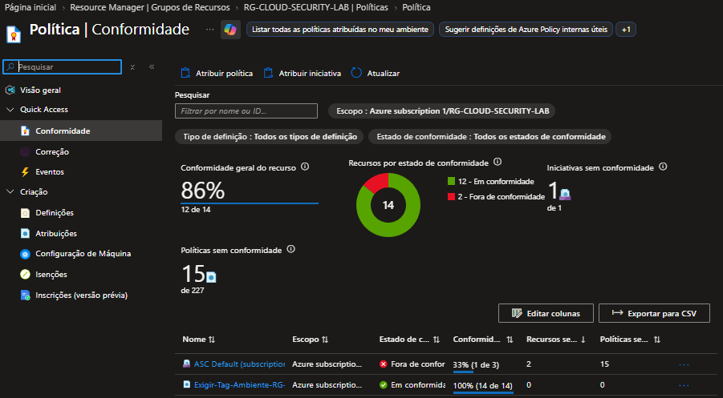
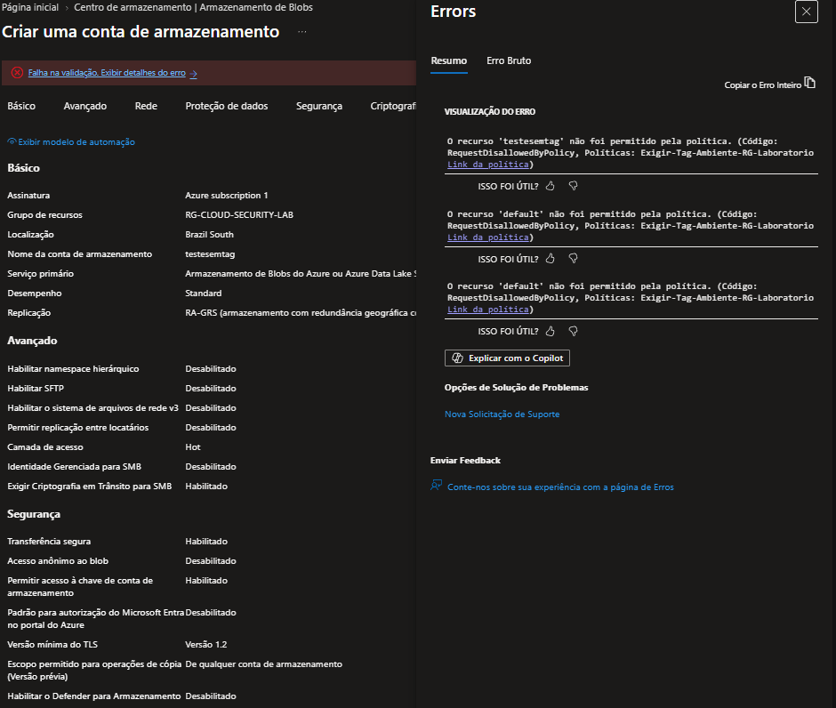

# Governança e Conformidade — Azure Policy

## Objetivo
Evoluir o laboratório do controle de acesso reativo para o controle preventivo de conformidade utilizando o **Azure Policy**, garantindo que todos os recursos sigam padrões organizacionais (tags obrigatórias).

---

## Implementação da Política de Tags

Foi implementada uma política para exigir a presença obrigatória da tag `Ambiente` em qualquer recurso criado dentro do escopo do laboratório (`RG-CLOUD-SECURITY-LAB`).

### Definição da Política (JSON)
Foi utilizado o modo `All` para garantir que o motor do Azure Policy intercepte todas as requisições de criação (`PUT/PATCH`) no momento da submissão:

```json
{
  "mode": "All",
  "policyRule": {
    "if": {
      "field": "tags['Ambiente']",
      "exists": "false"
    },
    "then": {
      "effect": "deny"
    }
  },
  "parameters": {}
}
```
## Validação e Evidências

A tentativa de criação de uma conta de armazenamento (testesemtag) sem a tag obrigatória resultou no bloqueio preventivo pelo Azure Policy, confirmando a eficácia do controle.

Nota: O erro RequestDisallowedByPolicy confirma que o Azure interceptou a requisição e negou a operação antes da criação do recurso.





[Retornar ao Laboratório →](../README.md)
