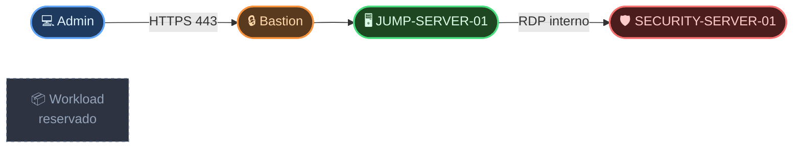

# Cloud Security Lab — Microsoft Azure

> Laboratório prático de Cloud Security desenvolvido de forma incremental, com foco em segmentação de rede, controle de acesso, redução de exposição e evolução dos controles de segurança.

---

## Visão Geral

Este projeto documenta a construção de um ambiente de Cloud Security no Microsoft Azure.

O laboratório está sendo desenvolvido passo a passo. Cada etapa registra o estado atual do ambiente, as decisões tomadas, os ajustes realizados e as validações executadas.

A ideia é permitir acompanhar não apenas o resultado final, mas também a evolução da infraestrutura ao longo do projeto.

---

## Arquitetura Atual

## Arquitetura Atual

<div align="center">



</div>

---

## Estado do Projeto

| Área | Status | Acompanhar |
|---|---|---|
| Arquitetura | Em evolução | [Ver arquitetura →](./01-arquitetura/arquitetura.md) |
| Rede | Em evolução | [Ver rede →](./02-rede/rede.md) |
| Controle de Acesso | Em evolução | [Ver controle de acesso →](./03-controle-acesso/controle-acesso.md) |
| Identidade | Em evolução | [Ver identidade →](./05-identidade/entra-id.md) |
| Governança | Em evolução | [Ver governança →](./06-governanca/azure-policy.md) |
| Exposição Pública (Bastion) | Em evolução | [Ver detalhes →](./03-controle-acesso/bastion-implementation.md) |
| Hardening | Planejado | Próximo |
| Monitoramento | Planejado | Próximo |


---

## O que já foi construído

### Rede

A infraestrutura foi criada utilizando uma VNet dedicada:

`VNET-CLOUD-SECURITY — 10.10.0.0/16`

Com três sub-redes:

- `SNET-MANAGEMENT` — `10.10.10.0/24`
- `SNET-SECURITY` — `10.10.20.0/24`
- `SNET-WORKLOAD` — `10.10.30.0/24`

A rede foi segmentada de acordo com a função de cada ambiente.

[Ver evolução da rede →](./02-rede/rede.md)

### Controle de Acesso

Foram criados NSGs específicos para cada subnet:

- `NSG-MANAGEMENT`
- `NSG-SECURITY`
- `NSG-WORKLOAD`

Também foi implementado o `JUMP-SERVER-01` como ponto central de administração.

[Ver evolução do controle de acesso →](./03-controle-acesso/controle-acesso.md)

### Servidores

O ambiente atualmente possui:

- `JUMP-SERVER-01` — `10.10.10.4`
- `SECURITY-SERVER-01` — `10.10.20.4`

O `SECURITY-SERVER-01` não possui IP público.

O acesso administrativo ao servidor interno foi validado através do Jump Server.

### Governança e Conformidade
Implementamos o **Azure Policy** para garantir que nenhum recurso seja provisionado sem a tag `Ambiente`. Isso marca a transição de um ambiente puramente funcional para um ambiente governado e preparado para escala corporativa.

[Ver detalhes da governança →](./06-governanca/azure-policy.md)

---

## Validação Atual

O fluxo administrativo validado foi:

```text
Máquina Administrativa
        |
        | RDP
        v
JUMP-SERVER-01
10.10.10.4
        |
        | RDP
        v
SECURITY-SERVER-01
10.10.20.4
```

O acesso ao servidor interno não é realizado diretamente pela Internet.

As evidências das validações são armazenadas na pasta:

[Ver evidências →](./04-evidencias/)

---

## Próxima Etapa

### Microsoft Entra ID

A próxima etapa será evoluir o controle de identidade e acesso, trabalhando:

- Microsoft Entra ID
- RBAC
- MFA
- Princípio do menor privilégio
- Controles de acesso administrativos

---

## Documentação

| Área | Conteúdo |
|---|---|
| [Arquitetura](./01-arquitetura/arquitetura.md) | Estrutura e decisões arquiteturais |
| [Rede](./02-rede/rede.md) | VNet, subnets, endereçamento e evolução da rede |
| [Controle de Acesso](./03-controle-acesso/controle-acesso.md) | NSGs, Jump Server e fluxo administrativo |
| [Identidade](./05-identidade/entra-id.md) | Microsoft Entra ID, RBAC e MFA |
| [Governança](./06-governanca/azure-policy.md) | Azure Policy e conformidade preventiva |
| [Evidências](./04-evidencias/) | Capturas e evidências utilizadas pelas demais etapas |
| [Bastion](./03-controle-acesso/bastion-implementation.md) | Eliminação de exposição pública via Azure Bastion |

---

## Stack

`Microsoft Azure` · `Virtual Network` · `Network Security Groups` · `Windows Server 2025` · `Microsoft Entra ID` · `RBAC` · `Cloud Security`
