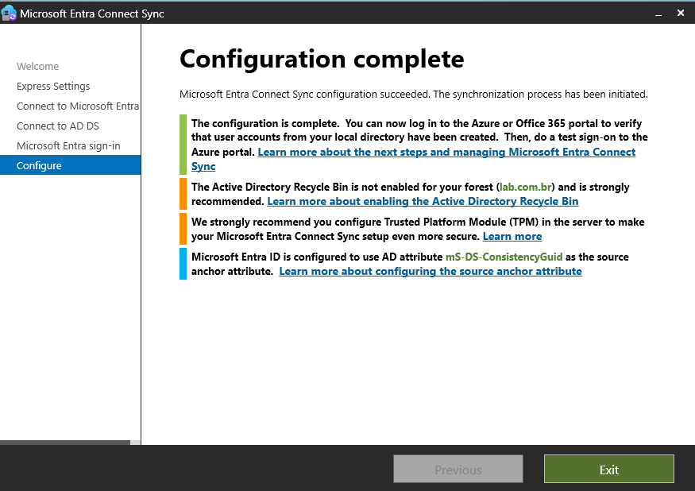
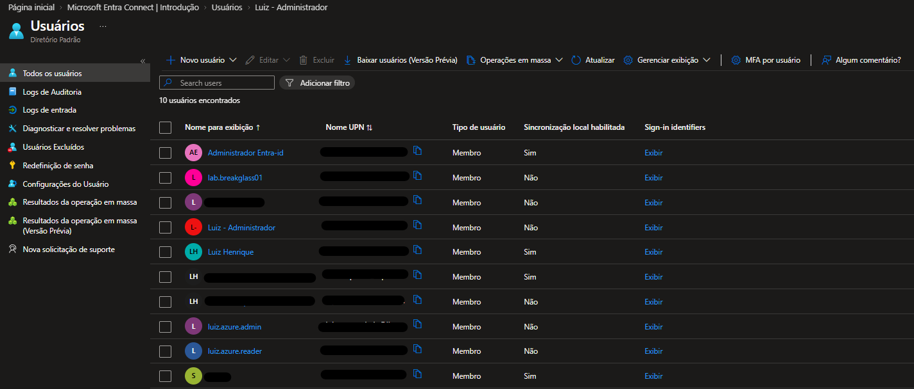

# Identidade & Integração Híbrida — Active Directory & Microsoft Entra Connect

<strong>📜 Histórico de Evolução</strong>

| Data | Alteração |
|---|---|
| 2026-03 | Implementação do Active Directory no Windows Server 2025 e execução da sincronização híbrida via Microsoft Entra Connect. |

## 🎯 Objetivo

Aqui testo na prática o ciclo de vida de identidades em um ambiente híbrido: a identidade é criada e administrada no Active Directory local e os objetos configurados para sincronização são refletidos no Microsoft Entra ID.

## ⚙️ O que foi feito na prática

1. **Estrutura Local (AD DS):**
   - Implementação do Active Directory no Windows Server 2025.
   - Organização de usuários, grupos e computadores da infraestrutura.
2. **Integração Híbrida (Entra Connect):**
   - Instalação e configuração do Microsoft Entra Connect no servidor do domínio.
   - Validação do fluxo de sincronização de diretórios, incluindo password hash synchronization e provisionamento de objetos.
3. **Validação na Nuvem:**
   - Verificação dos objetos configurados para sincronização no Microsoft Entra ID.
   - Confirmação de que a origem local e o estado de sincronização aparecem corretamente no ambiente de nuvem.

## 📊 Evidências da Integração

### 🟢 Conclusão do Assistente de Instalação do Entra Connect

> Evidência do término bem-sucedido da configuração de sincronização híbrida.

### 👥 Usuários Sincronizados no Microsoft Entra ID

> Visão no portal mostrando os usuários sincronizados e a origem local.

## ⏭️ Próximos Testes

- Validar políticas de acesso condicional com identidades sincronizadas.
- Testar desprovisionamento: desativar um usuário no AD local e acompanhar a alteração no Microsoft Entra ID.
- Validar o comportamento da sincronização após alterações de atributos, grupos e permissões.

## 📝 Observações

>

---

[← Arquitetura](../01-arquitetura/arquitetura.md) · [← Laboratório](../README.md)
