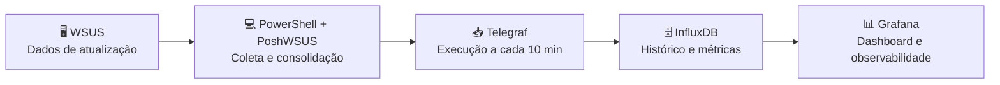

# ⚙️ Gerenciamento

Gerenciamento de atualizações, aplicação de patches e acompanhamento de conformidade no ambiente **On-Premises**, utilizando uma camada de observabilidade sobre o **WSUS**.

## 🎯 Objetivo

Ampliar a visibilidade operacional do **WSUS (Windows Server Update Services)**, transformando seus dados de atualização e conformidade em **indicadores, histórico e dashboards centralizados**.

A solução **não substitui o WSUS**; adiciona uma camada de observabilidade para facilitar o acompanhamento e identificar rapidamente máquinas e atualizações que exigem atenção.

## 🏗️ Solução

---
## 📊 Indicadores monitorados

| Indicador                     | Descrição                           |
| ----------------------------- | ----------------------------------- |
| 🖥️ **Total de máquinas**     | Clientes identificados pelo WSUS    |
| ✅ **Conformes**               | Sem atualizações que exigem atenção |
| 🟠 **Pendentes**              | Atualizações ainda não instaladas   |
| 🔴 **Falhas**                 | Atualizações em estado de falha     |
| 🔄 **Reboot pendente**        | Necessidade de reinicialização      |
| ❓ **Unknown**                 | Estado de atualização desconhecido  |
| 📡 **Sem reporte > 3 dias**   | Clientes sem reporte ao WSUS        |
| 🔄 **Sincronização**          | Resultado da última sincronização   |
| 📦 **Atualizações pendentes** | KB, título e estado por máquina     |

## 🗄️ Dados no InfluxDB

A solução utiliza três medições:

* **`wsus-stats`** — indicadores consolidados e evolução histórica.
* **`wsus-machines`** — status, pendências, falhas, reboot, estado desconhecido, último reporte e sincronização de cada máquina.
* **`wsus-updates`** — máquina, KB, título, estado e ID das atualizações que exigem atenção.

## 📈 Dashboard Grafana

O dashboard centraliza:

* conformidade geral;
* máquinas conformes, pendentes e com falha;
* atualizações pendentes por máquina;
* atualizações em falha;
* máquinas sem reporte há mais de 3 dias;
* sincronização dos clientes;
* evolução histórica de pendências e falhas.

## 🔄 Funcionamento

O **PowerShell**, utilizando **PoshWSUS**, consulta a API administrativa do WSUS e consolida os dados. O **Telegraf 1.39.3** executa o script em intervalo configurável e envia as métricas ao **InfluxDB 1.12.4**, que mantém o histórico consumido pelo **Grafana**.

A coleta está configurada para ocorrer a cada **10 minutos**.

## 💡 Resultado

A solução transforma informações operacionais do WSUS em uma **visão centralizada, histórica e de rápida interpretação**, permitindo identificar:

* máquinas com pendências ou falhas;
* clientes que deixaram de reportar;
* atualizações aprovadas ainda não instaladas;
* evolução dos indicadores ao longo do tempo.

Assim, o WSUS mantém sua função de gerenciamento de atualizações enquanto o Grafana fornece uma camada adicional de **observabilidade operacional e acompanhamento de conformidade**.

## 🧰 Tecnologias

| Tecnologia              | Utilização                    |
| ----------------------- | ----------------------------- |
| 🪟 **Windows Server**   | Plataforma do ambiente        |
| 🔄 **WSUS**             | Gerenciamento de atualizações |
| 💻 **PowerShell**       | Automação e coleta            |
| 🔌 **PoshWSUS**         | Integração com o WSUS         |
| 📥 **Telegraf 1.39.3**  | Execução periódica e coleta   |
| 🗄️ **InfluxDB 1.12.4** | Armazenamento histórico       |
| 📊 **Grafana**          | Visualização e acompanhamento |

## 🖼️ Evidência

Dashboard da solução em funcionamento:

## 📚 Relação com o laboratório

Projeto integrante da área de **Gerenciamento** do laboratório **On-Premises**, complementando as práticas de atualizações, patches, monitoramento e conformidade.

[← Voltar ao Laboratório](../README.md)
