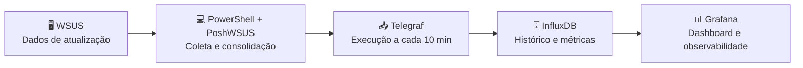
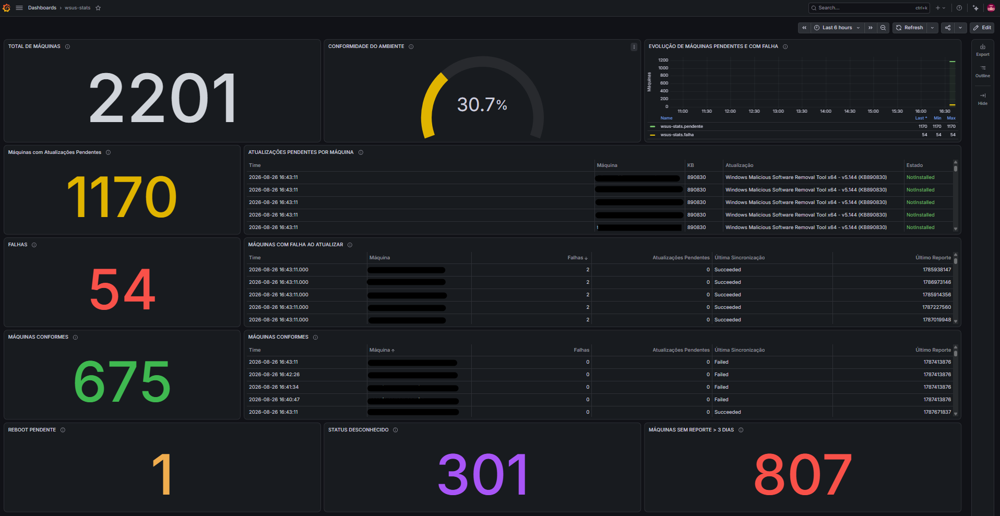

# ⚙️ Gerenciamento

Gerenciamento de atualizações, aplicação de patches e acompanhamento de conformidade no ambiente **On-Premises**, com uma camada de observabilidade construída sobre o WSUS.

## 🎯 Objetivo

O objetivo deste projeto foi ampliar a visibilidade operacional do **WSUS (Windows Server Update Services)**, transformando os dados de conformidade e atualização já disponibilizados pelo WSUS em indicadores, histórico e dashboards centralizados.

A solução não substitui o WSUS. Ela adiciona uma camada de observabilidade para facilitar o acompanhamento do ambiente e identificar rapidamente máquinas e atualizações que exigem atenção.

## 🏗️ Solução

O fluxo transforma os dados operacionais do WSUS em métricas históricas e informações de fácil acompanhamento no Grafana.

## 📊 Indicadores monitorados

A coleta consolida informações relevantes para o acompanhamento do ambiente:

| Indicador | Descrição |
|---|---|
| 🖥️ **Total de máquinas** | Clientes identificados pelo WSUS |
| ✅ **Conformes** | Máquinas sem atualizações que exigem atenção |
| 🟠 **Pendentes** | Máquinas com atualizações ainda não instaladas |
| 🔴 **Falhas** | Máquinas com atualizações em estado de falha |
| 🔄 **Reboot pendente** | Máquinas que necessitam de reinicialização |
| ❓ **Unknown** | Máquinas com estado de atualização desconhecido |
| 📡 **Sem reporte > 3 dias** | Clientes sem reporte ao WSUS há mais de três dias |
| 🔄 **Sincronização** | Resultado da última sincronização dos clientes |
| 📦 **Atualizações pendentes** | KB, título e estado das atualizações por máquina |

## 🗄️ Dados no InfluxDB

Os dados são organizados em três medições principais:

### `wsus-stats`

Armazena os indicadores consolidados do ambiente, permitindo acompanhar os números gerais e sua evolução histórica.

### `wsus-machines`

Representa a situação individual das máquinas, incluindo:

- nome da máquina;
- status de conformidade;
- quantidade de atualizações pendentes;
- quantidade de falhas;
- reinicialização pendente;
- estado desconhecido;
- último reporte;
- resultado da última sincronização.

### `wsus-updates`

Registra as atualizações que exigem atenção, relacionando:

- máquina;
- KB;
- título da atualização;
- estado;
- ID da atualização.

## 📈 Dashboard Grafana

O dashboard centraliza a visualização do ambiente e permite acompanhar:

- visão geral de conformidade;
- máquinas conformes, pendentes e com falha;
- atualizações pendentes por máquina;
- atualizações em estado de falha;
- máquinas sem reporte há mais de 3 dias;
- status de sincronização dos clientes;
- evolução histórica das máquinas pendentes;
- evolução histórica das máquinas com falha.

## 🔄 Funcionamento

O **PowerShell**, utilizando **PoshWSUS**, consulta a API administrativa do WSUS e consolida os dados de conformidade e atualização.

O **Telegraf** executa o script automaticamente em intervalo configurável e envia as métricas para o **InfluxDB**.

O **InfluxDB** mantém o histórico dos dados, enquanto o **Grafana** utiliza essas informações para apresentar indicadores e tendências do ambiente.

No ambiente documentado, a coleta está configurada para ocorrer a cada **10 minutos**.

## 💡 Resultado

O principal ganho da solução foi transformar informações operacionais do WSUS em uma **visão centralizada, histórica e de rápida interpretação**.

Em vez de depender exclusivamente de consultas operacionais dentro do WSUS para identificar situações de atenção, o dashboard permite acompanhar de forma mais direta:

- onde estão as pendências;
- quais máquinas apresentam falhas;
- quais clientes deixaram de reportar;
- quais atualizações aprovadas ainda não foram instaladas;
- como esses indicadores evoluem ao longo do tempo.

A proposta é complementar o WSUS com observabilidade, facilitando o acompanhamento operacional e apoiando a identificação de pontos que necessitam de intervenção.

## 🧰 Tecnologias

| Tecnologia | Utilização |
|---|---|
| 🪟 **Windows Server** | Plataforma do ambiente |
| 🔄 **WSUS** | Gerenciamento de atualizações |
| 💻 **PowerShell** | Automação e coleta |
| 🔌 **PoshWSUS** | Integração com o WSUS |
| 📥 **Telegraf 1.39.3** | Execução periódica e coleta das métricas |
| 🗄️ **InfluxDB 1.12.4** | Armazenamento do histórico |
| 📊 **Grafana** | Visualização e acompanhamento |

## 🖼️ Evidência

Dashboard utilizado para demonstrar a solução em funcionamento:

## 📚 Relação com o laboratório

Este projeto faz parte da área de **Gerenciamento** do laboratório On-Premises e complementa as práticas relacionadas a atualizações, patches, monitoramento e conformidade.

[← Voltar ao Laboratório](../README.md)
