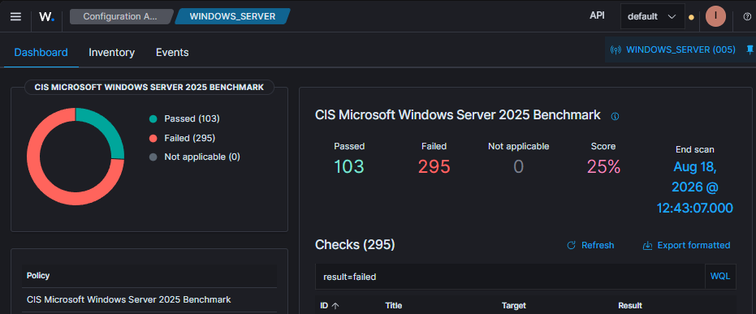
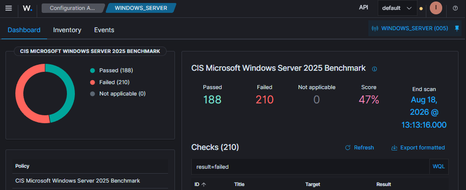

# Hardening & Compliance — Windows Server & CIS Benchmarks

<strong>📜 Histórico de Evolução</strong>

| Data | Alteração |
|---|---|
| 2026-03 | Análise de aplicabilidade e execução de script automatizado para hardening parcial do Windows Server com base nas recomendações CIS do Wazuh. |
| 2026-03 | Validação prática e captura de evidências com comparativo de pontuação de conformidade antes e depois. |

## 🎯 Objetivo

Aplicar hardening ao Windows Server com critério, usando as recomendações do CIS como referência e validando quais controles fazem sentido para o ambiente antes de automatizar sua aplicação.

## 🛠️ Abordagem Prática

1. **Auditoria de Postura:** execução da avaliação do Wazuh para estabelecer o cenário inicial.
2. **Análise de Aplicabilidade:** avaliação dos controles identificados, separando ajustes aplicáveis de pontos que exigem exceções ou contexto adicional.
3. **Automação:** criação de um script para aplicar os ajustes selecionados de forma reproduzível.
4. **Validação:** nova avaliação para comparar a postura antes e depois e verificar se os ajustes produziram o resultado esperado sem comprometer as funcionalidades testadas.

## 📊 Evidências de Melhoria

### 🔴 Cenário Inicial

> Pontuação e alertas identificados antes da aplicação do hardening.

### 🟢 Após o Hardening

> Resultado da nova avaliação após a aplicação dos ajustes selecionados.

## ⏭️ Próximos Testes

- Avaliar novos pontos de melhoria nas políticas de auditoria.
- Validar exceções e controles que não foram aplicados inicialmente.
- Levar a mesma abordagem de hardening com critério para o ambiente Linux.

## 📝 Observações

>

---

[← Identidade](../02-identidade/identidade.md) · [← Laboratório](../README.md)
